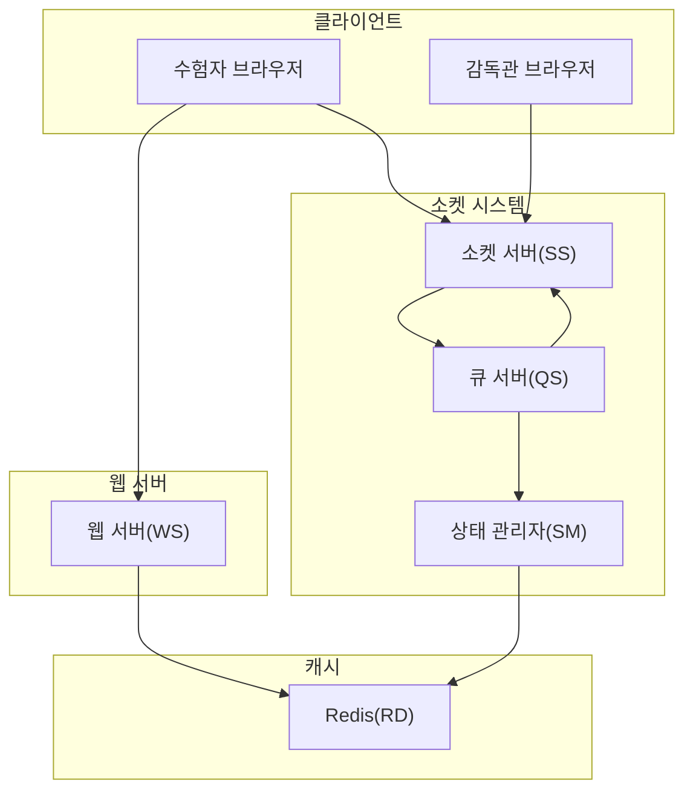
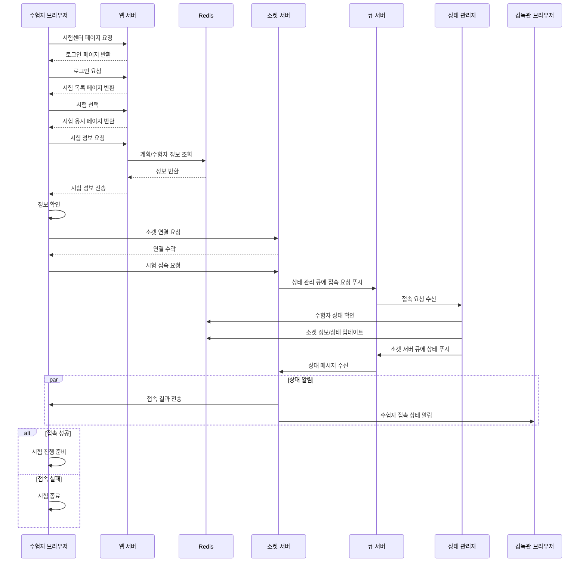

# 수험자 초기화 프로세스

## 1. 웹 접속 단계

-   시험센터 접속
-   로그인 인증
-   시험 선택

## 2. 시험 정보 초기화

-   시험 정보 요청
-   Redis에서 정보 조회
-   정보 전달 및 확인

## 3. 소켓 연결 단계

-   소켓 서버 연결
-   시험 접속 요청
-   상태 검증 및 업데이트

## 4. 상태 확인 단계

-   접속 상태 전파
-   결과 확인
-   진행 여부 결정

