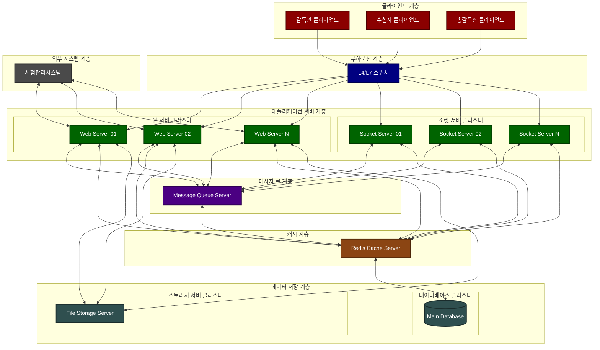

# 온라인 시험 시스템 아키텍처 설계서

## 1. 개요

### 1.1 목적

-   온라인 시험을 안정적으로 운영할 수 있는 분산 시스템 구축
-   외부 시험관리시스템과 연계하여 시험 운영의 전체 생명주기 관리
-   실시간 모니터링 및 부정행위 방지 기능 제공

### 1.2 범위

-   시험 준비, 시행, 종료까지의 전체 프로세스
-   수험자 및 감독관 관리
-   시험 진행 상황 실시간 모니터링
-   시험 결과 처리 및 외부 시스템 연계

## 2. 시스템 아키텍처

### 2.1 전체 시스템 구성도

-   계층별 표준 명명 규칙:

    -   클라이언트 계층: ClientLayer
    -   부하분산 계층: LoadBalancer
    -   애플리케이션 서버 계층: AppServer
    -   메시지 큐 계층: QueueServer
    -   캐시 계층: CacheServer
    -   데이터 저장 계층: DataStore
    -   외부 시스템 계층: ExternalSystem

-   서버 명명 규칙:
    -   Web Server XX (XX는 일련번호)
    -   Socket Server XX
    -   Message Queue Server
    -   Redis Cache Server
    -   Main Database
    -   File Storage Server

### 2.3 계층별 구성요소

#### 2.3.1 클라이언트 계층

-   **구성**
    -   감독관용 웹 클라이언트
    -   수험자용 웹 클라이언트
    -   총감독관용 웹 클라이언트
-   **주요기능**
    -   브라우저 기반 인터페이스 제공
    -   WebSocket을 통한 실시간 통신
    -   부정행위 방지를 위한 브라우저 제어

#### 2.3.2 로드밸런싱 계층

-   **구성**
    -   L4/L7 스위치
-   **주요기능**
    -   트래픽 부하 분산
    -   서버 헬스 체크
    -   장애 서버 자동 제외

#### 2.3.3 애플리케이션 서버 계층

-   **웹 서버**
    -   HTTP 기반 요청 처리
    -   RESTful API 제공
    -   정적 리소스 제공
-   **소켓 서버**
    -   WebSocket 연결 관리
    -   실시간 이벤트 처리
    -   시험 진행 상태 동기화

#### 2.3.4 메시지 큐 계층

-   **구성**
    -   큐 서버
-   **주요기능**
    -   비동기 작업 처리
    -   서버간 메시지 전달
    -   시스템 간 결합도 감소

#### 2.3.5 캐시 계층

-   **구성**
    -   이중화된 Redis 서버
-   **주요기능**
    -   세션 관리
    -   실시간 데이터 캐싱
    -   시스템 성능 최적화

#### 2.3.6 데이터베이스 계층

-   **구성**
    -   Master DB (1대)
-   **주요기능**
    -   데이터 영구 저장

#### 2.3.7 파일 서버 계층

-   **구성**
    -   파일 서버
-   **주요기능**
    -   시험 콘텐츠 저장
    -   답안 파일 관리
    -   백업 및 복구

### 2.4 시스템 연계

-   **외부 시험관리시스템 연계**
    -   REST API 기반 통신
    -   데이터 동기화
    -   결과 전송
