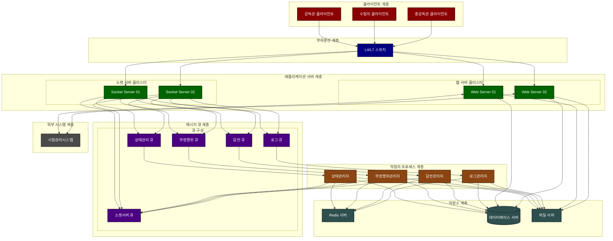

주요 변경사항:

1. 메시지 큐 계층

    - 5개의 전용 큐 추가 (소켓서버/상태관리/부정행위/답안/로그)
    - 각 큐의 역할과 구독관계 명시

2. 작업자 프로세스 계층 추가

    - 상태관리자: 상태관리 큐 구독, 전체 상태 관리
    - 부정행위관리자: 부정행위 큐 구독, 부정행위 통계 관리
    - 답안관리자: 답안 큐 구독, 답안 데이터 관리
    - 로그관리자: 로그 큐 구독, 시스템 로그 관리

3. 데이터 흐름 명확화
    - 소켓서버에서 각 큐로의 메시지 발행
    - 작업자의 큐 구독 관계
    - 작업자의 상태 전파 경로 (소켓서버 큐 활용)
    - 저장소 계층과의 연결 관계

### 2.3 계층별 구성요소

#### 2.3.1 클라이언트 계층

-   **감독관 클라이언트**

    -   시험 감독 화면 제공
    -   실시간 수험자 모니터링
    -   부정행위 확인 및 처리
    -   상태 제어 기능

-   **수험자 클라이언트**

    -   시험 응시 환경 제공
    -   부정행위 방지 기능
    -   답안 작성 및 저장
    -   실시간 상태 동기화

-   **총감독관 클라이언트**
    -   전체 시험 현황 모니터링
    -   그룹별 현황 관리
    -   통계 정보 조회

#### 2.3.2 서버 계층

-   **웹 서버**

    -   REST API 제공
    -   정적 리소스 제공
    -   파일 업로드/다운로드
    -   외부 시스템 연동

-   **소켓 서버**
    -   WebSocket 연결 관리
    -   실시간 메시지 처리
    -   상태 변경 브로드캐스트
    -   이벤트 발행

#### 2.3.3 메시지 큐 계층

-   **소켓서버 큐**

    -   실시간 상태 브로드캐스트
    -   클라이언트 알림 메시지

-   **상태관리 큐**

    -   시험 진행 상태
    -   수험자 상태
    -   감독관 상태
    -   단계 진행 상태

-   **부정행위 큐**

    -   부정행위 감지 이벤트
    -   부정행위 제어 메시지
    -   경고/실격 처리 메시지

-   **답안 큐**

    -   답안 저장 메시지
    -   답안 변경 이력
    -   제출 상태 메시지

-   **로그 큐**
    -   시스템 로그
    -   감사 로그
    -   보안 로그

#### 2.3.4 작업자 프로세스 계층

-   **상태관리자**

    -   상태관리 큐 구독
    -   시험/수험자/감독관 상태 관리
    -   단계별 진행 상태 관리
    -   Redis 상태 정보 갱신
    -   상태 변경 브로드캐스트

-   **부정행위관리자**

    -   부정행위 큐 구독
    -   부정행위 통계 관리
    -   임계치 모니터링
    -   제어 상태 관리
    -   부정행위 이력 관리

-   **답안관리자**

    -   답안 큐 구독
    -   답안 데이터 저장
    -   변경 이력 관리
    -   제출 상태 관리
    -   답안 통계 관리

-   **로그관리자**
    -   로그 큐 구독
    -   시스템 로그 저장
    -   감사 로그 기록
    -   로그 통계 관리

#### 2.3.5 저장소 계층

-   **Redis 서버**

    -   실시간 상태 정보
    -   세션 데이터
    -   답안 임시 저장
    -   통계 데이터

-   **데이터베이스 서버**

    -   마스터 데이터 저장
    -   이력 데이터 저장
    -   로그 데이터 저장
    -   통계 데이터 저장

-   **파일 서버**
    -   시험 콘텐츠 저장
    -   답안 파일 저장
    -   증거 자료 저장
    -   백업 데이터 관리
