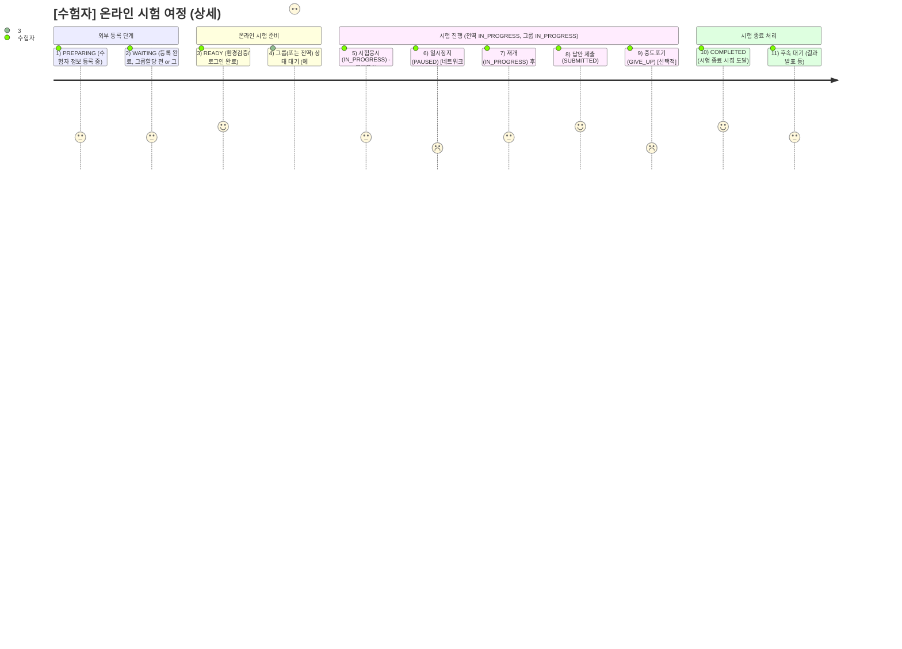
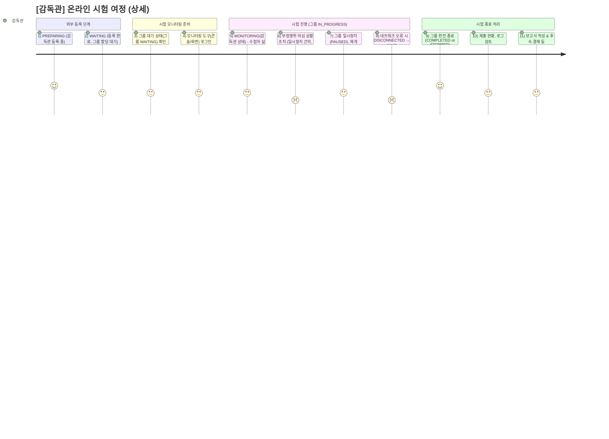
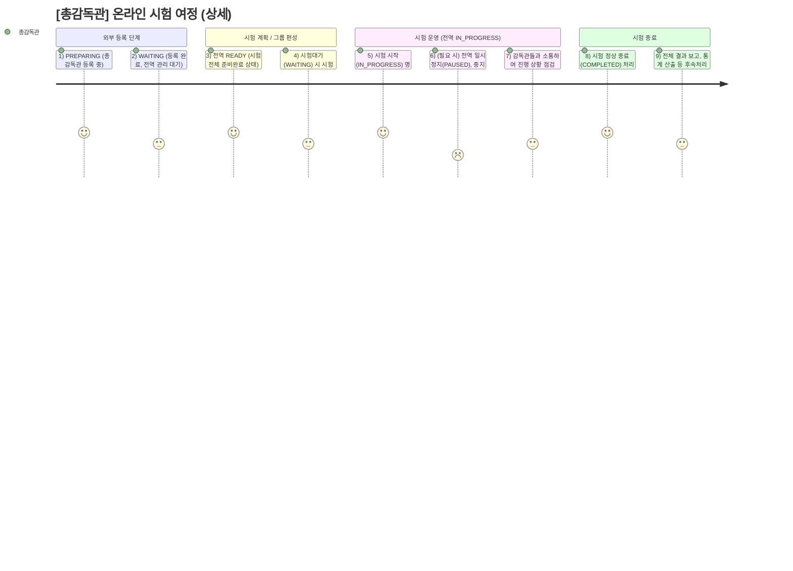

# **사용자 여정정 명세서**

**버전: 1.10.0** (최종 수정일: 2024-12-26)

---

## 변경 이력(Changelog)

## 개요

1. **User Journey 문법**
    - `journey` 블록 안에서 `section`으로 흐름(섹션)을 나누고, `액션: 점수: 사용자` 형식으로 작성
    - 점수(1~5)는 예시 만족도/편의성을 나타냄
2. **상태 반영**
    - 각 단계에서, 해당 사용자(로컬) 상태가 어떻게 변화하는지 또는 상위(전역/그룹) 상태가 어떻게 영향을 미치는지를 간략히 기술
    - 예: “IN_PROGRESS 상태가 되어야 가능”, “PAUSED 상태 발생 시 사용자 경험” 등
3. **실시스템 세부 단계**
    - 외부 관리 시스템에서의 등록(Preparing/Waiting)
    - 시험 진행(전역 IN_PROGRESS, 그룹 IN_PROGRESS)
    - 일시정지(PAUSED), 강제 중지(STOPPED), 종료(COMPLETED) 등

---

## 1. 수험자(Examinee) 여정

### 세부 설명

-   **(1)~(2)** PREPARING/WAITING: 외부 관리 시스템에서 수험자 등록(Preparing) → 최종 배정 완료 후, 온라인 시스템에서 WAITING
-   **(3) READY**: 실제 시험 브라우저 환경·장치 검증 및 로그인 완료
-   **(4) 그룹/전역이 아직 WAITING**이면 수험자는 진행 불가, “시험 시작”을 기다림
-   **(5)~(7) 시험응시**:
    -   전역 IN_PROGRESS & 그룹 IN_PROGRESS가 되어야 수험자도 IN_PROGRESS로 전환 → 문제풀이 가능
    -   PAUSED가 발생하면 풀이 중단(2점, 스트레스) → 재개 시 다시 IN_PROGRESS 복귀
-   **(8) SUBMITTED**: 답안 제출 후에는 수정 불가
-   **(9) GIVE_UP**: 수험자가 시험을 포기할 수도 있음 (중간 종료)
-   **(10) COMPLETED**: 시험 종료(시간 만료, 전역/그룹 COMPLETED) 시 수험자도 자동 COMPLETED
-   **(11) 후속 대기**: 결과 발표까지 대기

---

## 2. 감독관(Supervisor) 여정

### 세부 설명

-   **(1)~(2)** PREPARING/WAITING: 외부 관리 시스템에서 감독관 계정 등록 → 최종 등록 완료 (대기)
-   **(3)~(4)** 그룹이 아직 WAITING일 때, 감독관은 모니터링 준비만 할 수 있음
-   **(5) MONITORING**: 그룹이 IN_PROGRESS 되면, 감독관 로컬 상태도 MONITORING으로 전환. 수험자 목록·부정행위 감시
-   **(6) 부정행위 처리**: 스트레스(2점) 높은 업무
-   **(7) 일시정지/재개**: 그룹 PAUSED/IN_PROGRESS를 감독관이 직접 트리거 가능
-   **(8) 네트워크 오류**: DISCONNECTED 발생 시 재연결 필요
-   **(9)~(11) 시험 종료**: 그룹이 COMPLETED/STOPPED 되면, 감독관도 더 이상 모니터링 불가 → 보고서·피드백 작성

---

## 3. 총감독관(Chief Supervisor) 여정

### 세부 설명

-   **(1)~(2)** 외부 관리 시스템에서 총감독관 등록 → WAITING (전역 관리 권한 대기)
-   **(3) 전역 READY**: 시험 계획이 최종 확정, 전역 상태가 READY일 때, 세부 점검(그룹·감독관 할당)
-   **(4) 시험대기(WAITING)**: 시험 시간 도래 전까지 전체 체크
-   **(5) IN_PROGRESS 명령**: 전역을 시험진행으로 바꿔, 모든 그룹이 진행 가능해짐
-   **(6) 일시정지/중지 결정**: 시험 전체에 대한 결정을 내릴 권한(2점, 책임·스트레스 높음)
-   **(7) 감독관 협업**: 모니터링 현황 파악, 이상 상황 시 지시
-   **(8) COMPLETED**: 시험 정상 종료
-   **(9) 후속처리**: 결과 보고·통계 자료 작성 등

---

## 4. 종합 요약 (상위·하위 상태 연동)

-   **수험자**:
    -   외부 등록(PREPARING → WAITING) → READY(환경검증) → 시험 IN_PROGRESS (풀이) → PAUSED/RE-IN_PROGRESS(중단/재개) → SUBMITTED/GIVE_UP → COMPLETED
-   **감독관**:
    -   외부 등록(PREPARING → WAITING) → 그룹 IN_PROGRESS 시 모니터링(MONITORING) → 필요 시 PAUSED/STOPPED/COMPLETED 처리 → 보고서 작성
-   **총감독관**:
    -   외부 등록(PREPARING → WAITING) → 전역 READY/WAITING → 전역 IN_PROGRESS(시험 시작) → (필요 시) 일시정지/중지 → COMPLETED(정상 종료)
-   이들 여정은 **상태(전역·그룹·로컬) 변화**와 **실제 사용자 액션**(문제풀이, 모니터링, 결정) 간의 상호작용으로 구성됩니다.

---

## 5. 참고/활용 방안

1. **As-is vs. To-be**

    - 현재 시스템(As-is)의 여정을 분석하면, 각 단계에서 사용자 스트레스가 높은 부분(부정행위 대응, 네트워크 끊김 등)을 개선 포인트로 삼을 수 있습니다.
    - To-be 시나리오에서는 자동 알림, 안정된 네트워크 보조, UI 개선 등을 통해 사용자 만족도를 높일 수 있습니다.

2. **병행 Journeys**

    - 실제 운영 시, **수험자**, **감독관**, **총감독관**이 동시에 상호작용합니다.
    - 병행 시퀀스(수험자가 시험 풀이 중, 감독관이 모니터링, 총감독관이 전역 상태 제어)도 시퀀스 다이어그램이나 Activity Diagram으로 확장 가능.

3. **확장/커스터마이징**
    - 시험 옵션(예: 오픈북/논술형)이나 특수 케이스(재시험, 장애 발생 긴급 조치)를 여정에 추가해 세부 시나리오를 구체화할 수 있습니다.

---

## 6. 결론

-   **수험자**, **감독관**, **총감독관** 각각의 User Journey를, 실제 시스템 상태(PREPARING, WAITING, IN_PROGRESS, PAUSED, STOPPED, COMPLETED 등)에 따라 세분화했습니다.
-   각 여정의 단계마다 만족도(1~5점)를 매겨, 사용자 경험의 긍·부정 요소를 파악할 수 있습니다.
-   이 문서를 통해 **상태 기반 흐름** + **사용자 액션**을 명확히 이해하여, 향후 개선안을 도출하기 바랍니다.

(버전: 2.0.0)
