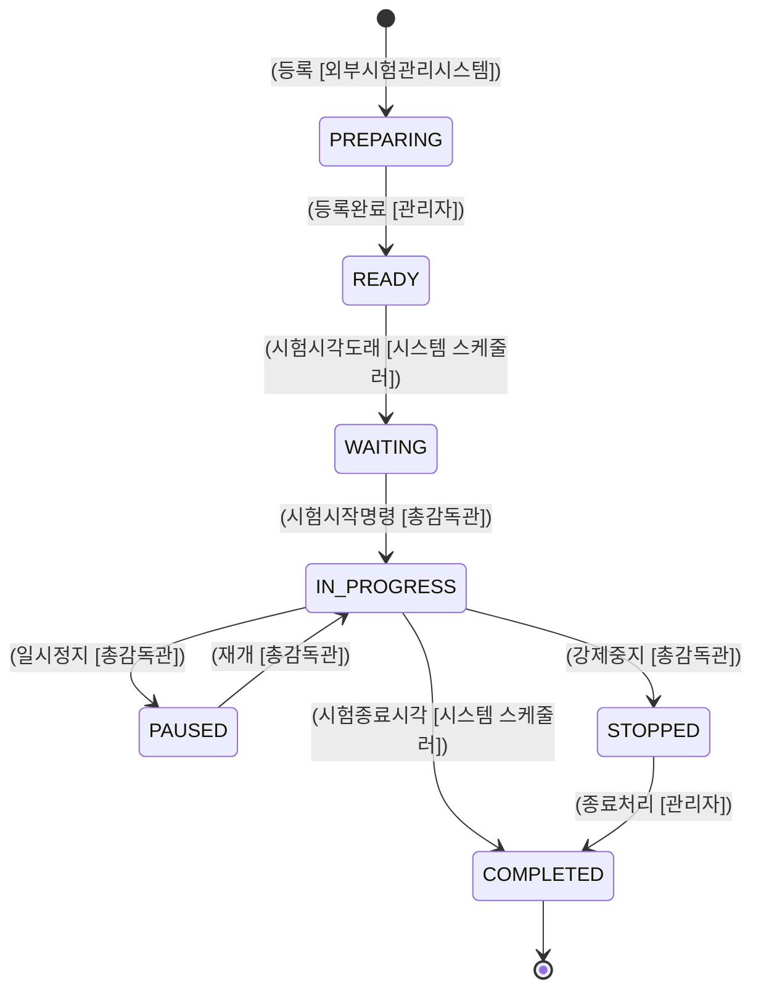
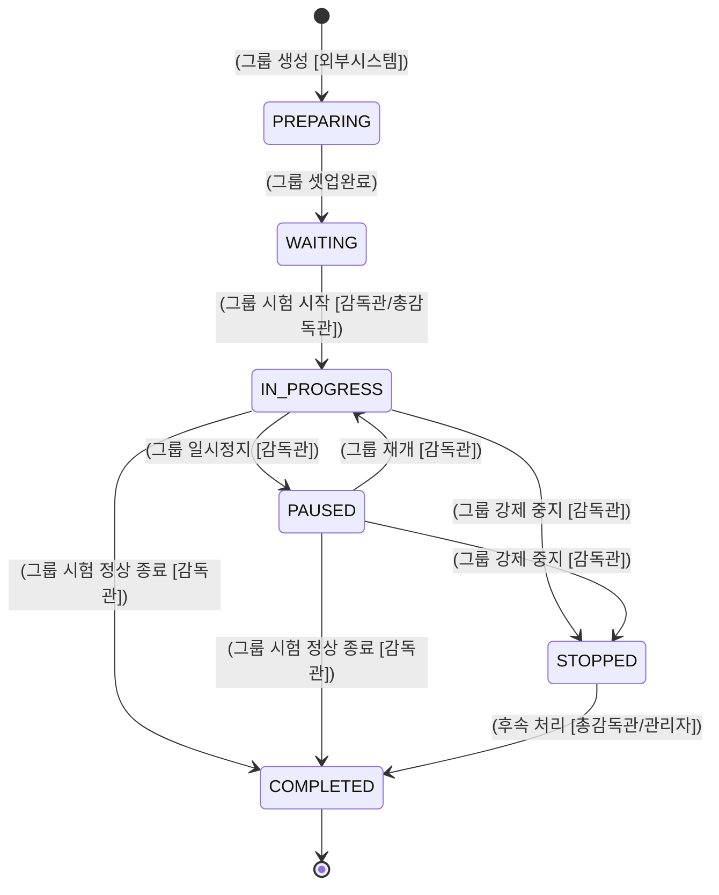
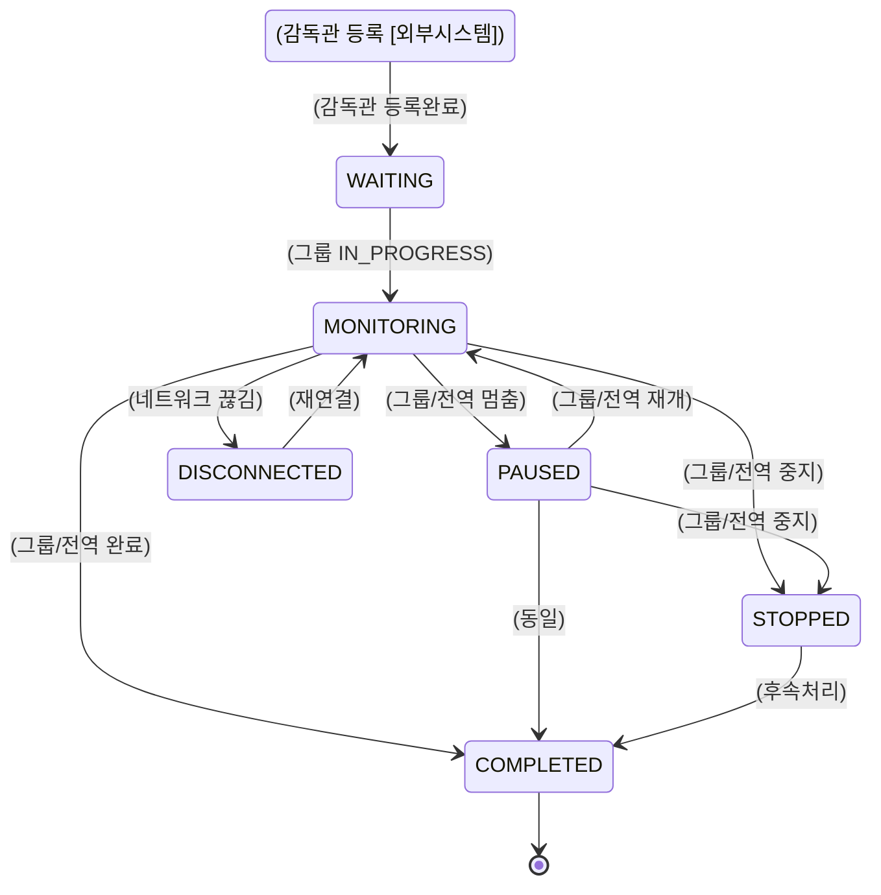
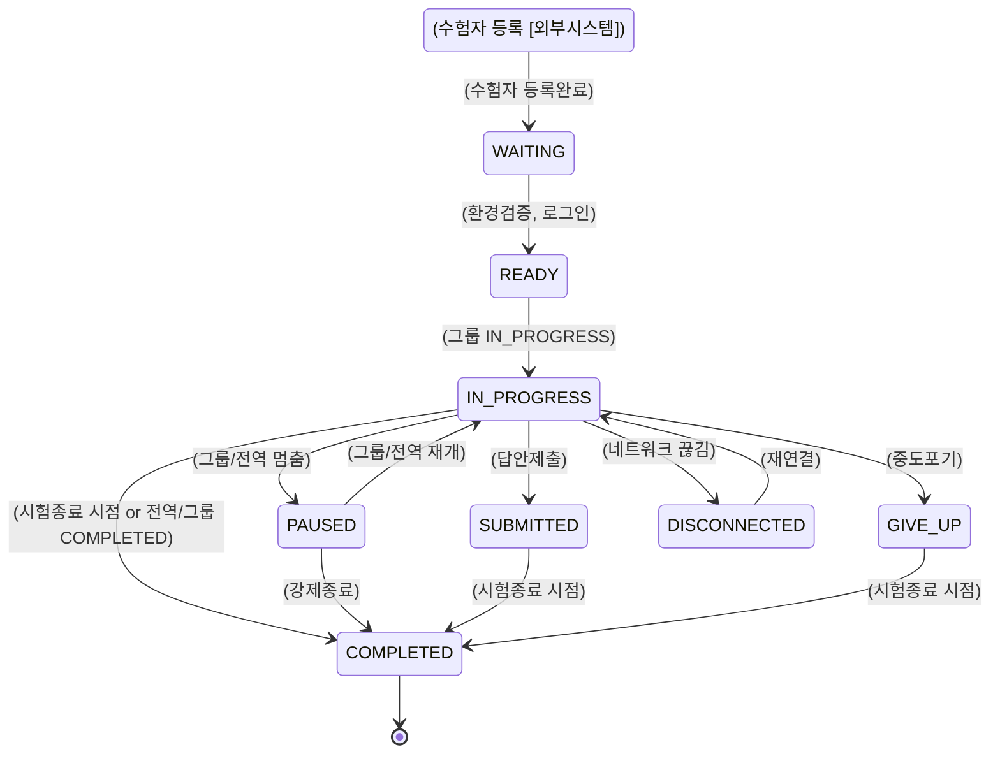
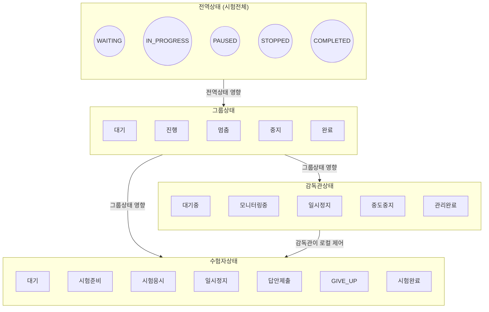

# **상태 명세서**

**버전: 1.10.0** (최종 수정일: 2024-12-26)

---

## 변경 이력(Changelog)

|  버전  |    일자    | 변경 내용                                                                                                                                 |  작성/수정자  |
| :----: | :--------: | :---------------------------------------------------------------------------------------------------------------------------------------- | :-----------: |
| 1.0.0  |     -      | 최초 문서 작성                                                                                                                            |  이동명 수석  |
| 1.1.0  | 2024-12-26 | Mermaid 기반 다이어그램 작성, 전역/로컬 상태 정의, 이벤트 및 주체 일부 표기                                                               |
| 1.2.0  | 2024-12-26 | 상태 변경 주체/이벤트 명시 다이어그램 보강, 글로벌 ↔ 로컬 상태 변화 영향 관계 다이어그램 및 설명 추가                                     | AI 어시스턴트 |
| 1.3.0  | 2024-12-26 | **준비중(PREPARING)** = 외부 시험관리시스템에서 시험계획 등록 단계 명시                                                                   |
| 1.4.0  | 2024-12-26 | 감독관 상태가 관리 중인 시험 그룹 및 하위 수험자 상태에 영향을 줄 수 있음 명시                                                            | AI 어시스턴트 |
| 1.5.0  | 2024-12-26 | 감독관은 전역상태(상위 단계)에 직접 영향을 주지 않는다는 요구사항 반영                                                                    | AI 어시스턴트 |
| 1.6.0  | 2024-12-26 | **그룹 상태**(준비/대기/진행/멈춤/중지/완료) 추가, 의존관계: 전역상태 > 그룹상태 > 감독관상태 > 수험자상태 반영                           | AI 어시스턴트 |
| 1.7.0  | 2024-12-26 | **전역 상태** 개념 설명 및 전이다이어그램 보강, 전체 문서 통합 작성                                                                       | AI 어시스턴트 |
| 1.8.0  | 2024-12-26 | **외부 관리 시스템**에서 시험 정보(계획/그룹/감독관/수험자) 확정 및 등록, 온라인 시스템은 진행중 상태·데이터만 관리 (CRUD 불가) 내용 반영 | AI 어시스턴트 |
| 1.9.0  | 2024-12-26 | **하위 상태**(그룹·감독관·수험자) 시작은 상위 상태(전역·그룹 등)가 ‘시작(IN_PROGRESS 등)’이 될 때까지 대기한다는 구조를 명시              | AI 어시스턴트 |
| 1.10.0 | 2024-12-26 | 감독관 상태, 수험자 상태에 대한 **상태전이 다이어그램** 추가                                                                              | AI 어시스턴트 |
| 1.11.0 | 2024-12-26 | **감독관·수험자** 상태의 **시작**을 `PREPARING → WAITING`으로 변경 (감독관·수험자 등록 절차 반영)                                         | AI 어시스턴트 |

---

## 1. 문서 개요

이 문서는 **온라인 시험 시스템**의 전역 상태, 그룹 상태, 감독관 상태, 수험자 상태를 포함한 **계층적 상태 모델**을 설명합니다.

-   **전역 상태**: 시험 전체
-   **그룹 상태**: 그룹 단위 시험 진행
-   **감독관 상태**: 시험 모니터링 담당자
-   **수험자 상태**: 시험 응시자

또한, 시험 정보(계획/그룹/감독관/수험자)에 대한 **CRUD**는 **외부 관리 시스템**에서 수행하며,  
온라인 시험 시스템은 오직 “시험 진행 상태”와 “진행 중 데이터(답안, 로그 등)”만 관리합니다.

---

## 2. 전역(Global) 상태

### 2.1 전역 상태 정의

|     상태     |    코드     | 설명                                                        |
| :----------: | :---------: | :---------------------------------------------------------- |
|  **준비중**  |  PREPARING  | 외부 시험관리시스템에서 시험계획 정보를 등록/편집 중인 단계 |
| **준비완료** |    READY    | 시험 운영 시작 전, 모든 준비를 마친 단계                    |
| **시험대기** |   WAITING   | 시험 시작 직전, 전체 시험 접속 대기                         |
| **시험진행** | IN_PROGRESS | 전체 시험이 실제 진행 중                                    |
| **시험멈춤** |   PAUSED    | 시험이 일시정지됨. 재개 시 IN_PROGRESS로 복귀               |
| **시험중지** |   STOPPED   | 시험이 강제 중지됨. 재개 불가                               |
| **시험완료** |  COMPLETED  | 시험이 정상 종료됨. 후속 통계 처리, 결과 산출 등 가능       |

### 2.2 전역 상태 전이(Transition)

---

## 3. 그룹(Group) 상태

### 3.1 그룹 상태 정의

|   상태   |    코드     | 설명                                                                 |
| :------: | :---------: | :------------------------------------------------------------------- |
| **준비** |  PREPARING  | 그룹 구성이 (외부 시스템에서) 완료되기 전, 온라인 시스템 내에서 대기 |
| **대기** |   WAITING   | 그룹 시험 시작 전, 해당 그룹의 수험자·감독관 접속 대기               |
| **진행** | IN_PROGRESS | 그룹 내 시험이 실제로 진행 중                                        |
| **멈춤** |   PAUSED    | 그룹 단위 시험이 일시정지됨. 재개 시 IN_PROGRESS로 복귀              |
| **중지** |   STOPPED   | 그룹 단위 시험이 강제로 중지됨. 재개 불가                            |
| **완료** |  COMPLETED  | 그룹 단위 시험이 정상 종료됨                                         |

### 3.2 그룹 상태 전이(Transition)

---

## 4. 감독관(Supervisor) 상태

### 4.1 상태 정의 (업데이트됨)

|       상태       |     코드     | 설명                                                                                                              |
| :--------------: | :----------: | :---------------------------------------------------------------------------------------------------------------- |
|    **준비중**    |  PREPARING   | **외부 관리 시스템**에서 감독관 등록 절차(개인정보/계정 등) 진행 중. 온라인 시스템에는 임시 등록 상태로 표시      |
|    **대기중**    |   WAITING    | 감독관 정보 등록이 완료된 상태. 하지만 그룹이 진행되지 않아 실제 모니터링은 불가                                  |
|  **모니터링중**  |  MONITORING  | 그룹이 진행(IN_PROGRESS) 상태일 때, 감독관이 수험자 모니터링/부정행위 감시/그룹 일시정지·중지·완료 처리 등을 수행 |
|   **일시정지**   |    PAUSED    | 그룹(또는 전역) 시험이 멈춤이면, 감독관 모니터링도 중단                                                           |
| **시험관리완료** |  COMPLETED   | 그룹(또는 전역)이 시험을 정상 종료하여 더 이상 관리할 사항이 없음                                                 |
|   **중도중지**   |   STOPPED    | 그룹(또는 전역)이 강제 중지됨. 감독관도 시험 관리 불가                                                            |
|   **연결끊김**   | DISCONNECTED | 감독관 네트워크 문제 등으로 연결 끊김. 재연결 시 `모니터링중(MONITORING)` 등 직전 상태 복귀 가능                  |

### 4.2 상태 전이(Transition) 다이어그램 (업데이트됨)

-   **PREPARING → WAITING**: 외부 관리 시스템에서 **감독관 등록**이 완료된 시점
-   **WAITING → MONITORING**: 소속 그룹이 IN_PROGRESS로 전환되면 모니터링 가능

---

## 5. 수험자(Examinee) 상태

### 5.1 상태 정의 (업데이트됨)

|       상태       |     코드     | 설명                                                                                                   |
| :--------------: | :----------: | :----------------------------------------------------------------------------------------------------- |
|    **준비중**    |  PREPARING   | **외부 관리 시스템**에서 수험자 등록 절차(계정 생성/배정 등) 진행 중. 온라인 시스템에는 임시 등록 상태 |
| **대기**(미응시) |   WAITING    | 수험자 등록이 완료된 상태. 하지만 그룹이 진행되지 않아 시험 응시 불가                                  |
|   **시험준비**   |    READY     | 수험자가 환경검증/로그인 등을 마치고 시험 시작만 대기                                                  |
|   **시험응시**   | IN_PROGRESS  | 실제 문제 풀이 중                                                                                      |
|   **일시정지**   |    PAUSED    | 그룹(또는 전역) 시험이 멈추면 수험자도 풀이 중단                                                       |
|   **답안제출**   |  SUBMITTED   | 답안을 모두 제출하여 더 이상 수정 불가                                                                 |
|   **중도포기**   |   GIVE_UP    | 수험자가 스스로 시험을 포기 (그룹/전역에는 영향 없음)                                                  |
|   **시험완료**   |  COMPLETED   | 시험 정상 종료 또는 시험종료 시점 도달                                                                 |
|   **연결끊김**   | DISCONNECTED | 네트워크 문제가 발생해 시스템과의 연결이 끊긴 상태. 재연결 시 직전 상태 복귀 가능                      |

### 5.2 상태 전이(Transition) 다이어그램 (업데이트됨)

-   **PREPARING → WAITING**: 외부 관리 시스템에서 수험자 등록을 완료(정보 확정)
-   **WAITING → READY**: 수험자가 실제 시험 브라우저나 환경 설정을 마친 상태
-   이후는 기존 흐름(IN_PROGRESS, PAUSED, GIVE_UP, COMPLETED 등)과 동일

---

## 6. 전체 그림 요약

-   **감독관(Supervisor) / 수험자(Examinee)** 모두 **PREPARING** 상태에서 시작합니다.
    -   외부 관리 시스템에서 등록 절차가 끝나면 **WAITING**으로 전이되어, 실제 시험 진행(그룹 IN_PROGRESS) 시점까지 대기.
-   이로써, 모든 엔티티가 “사전등록(Preparing) → 등록완료(Waiting)” 단계를 밟고, 상위(그룹/전역)가 진행될 때 응시/모니터링을 개시하도록 구조화되었습니다.

---

## 7. 전체 시각화 다이어그램 (좌→우 배치)

---

## 8. 문서 활용 및 주의사항

1. **외부 관리 시스템**
    - 시험 계획, 그룹, 감독관, 수험자 정보는 외부에서 확정 후 온라인 시스템에 등록
    - 온라인 시스템에서는 CRUD 없이 “진행 상태”와 “실시간 시험데이터”만 관리
2. **상태 전이 시나리오**
    - 전역→그룹→감독관→수험자 순으로 종속적. 상위가 진행 중이지 않으면 하위도 진행 불가
    - 멈춤/중지/완료 등도 상위 전이 시 하위 전이가 자동(또는 반자동) 발생
3. **네트워크/예외 처리**
    - 감독관/수험자 DISCONNECTED → 재연결 시 직전 상태 복원
    - 강제중지(STOPPED) 시 다시 재개 불가
4. **버전 관리**
    - 본 문서(버전: 1.10.0)는 **감독관 상태**, **수험자 상태** 각각의 **상태전이 다이어그램**을 추가한 최신 버전입니다.

---

## 9. 결론

-   **온라인 시험 시스템**은 시험정보(계획, 그룹, 감독관, 수험자)를 외부 시스템에서 넘겨받아, 시험 진행에만 집중합니다.
-   전역, 그룹, 감독관, 수험자 상태는 **상위→하위 의존** 관계를 가지며, 하위는 상위가 “시작(IN_PROGRESS)”되어야만 “진행” 가능하고, 상위가 “중지/완료”되면 하위도 이어서 종결되는 구조입니다.
-   위 **상태정의**와 **상태전이 다이어그램**을 통해, 시험 운영 흐름을 명확히 관리할 수 있습니다.

(버전: 1.10.0)
