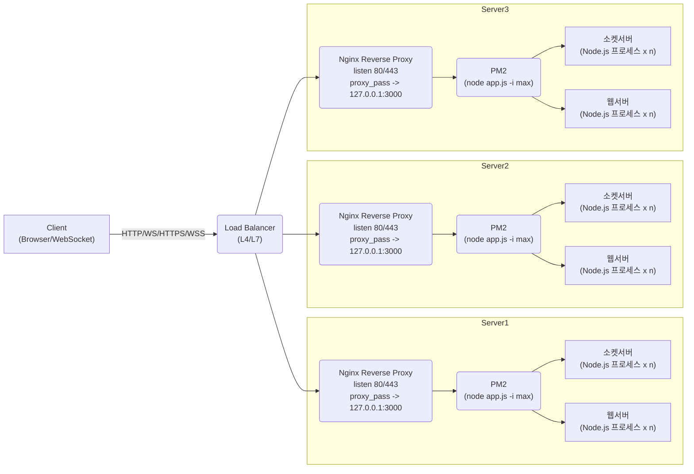

**소켓서버(WS)**와 **웹서버(HTTP)** 프로세스를 각각 **n개** 실행할 수 있는 구성과, **로드 밸런서(LB) + Nginx + PM2**를 통한 **Node.js 분산 운영** 방식.

---

## 1. 전체 구성도 (Mermaid)

아래 다이어그램은 **로드 밸런서**가 앞단에 위치하고, **Server1~3** 각각이 **Nginx + PM2** 구조로 Node.js 애플리케이션을 운영함을 보여줍니다. PM2는 **소켓서버**와 **웹서버**를 각각 **n개**(또는 CPU 코어 수만큼) 구동할 수 있습니다.



1. **로드 밸런서 (LB)**

    - L4(전송 계층) 또는 L7(애플리케이션 계층) 로드 밸런서를 통해 트래픽을 **Server1, Server2, Server3** 중 하나로 분산
    - 예: AWS ELB/ALB, GCP LB, Azure LB, 하드웨어 LB 등
    - Sticky Session(IP 해시, 쿠키 기반 등), SSL Pass-through 또는 Termination 등 옵션 설정 가능

2. **서버 노드**(Server1, Server2, Server3)

    - 각 서버에는 **Nginx**(포트 80/443) + **PM2**(Node.js 프로세스 매니저)로 구성
    - **PM2**가 **소켓서버**와 **웹서버** 프로세스를 각각 **n개**(또는 CPU 코어 수만큼) 실행
    - `proxy_pass` 통해 `127.0.0.1:3000`으로 트래픽이 전달되면, PM2가 내부 라운드 로빈으로 프로세스 분배
    - WebSocket 업그레이드, 정적 파일 서빙, SSL Termination 가능

3. **클라이언트**
    - `http(s)://<LB>` 또는 `ws(s)://<LB>`로 접근
    - 로드 밸런서가 특정 서버(예: Server2) 선택 → 해당 서버 Nginx → PM2 → (소켓서버/웹서버 프로세스) 순으로 요청 처리

---

## 2. PM2 + Nginx (서버 내 구성)

### 2.1 PM2 설정

1. **Cluster 모드**

    ```bash
    pm2 start app.js -i max
    ```

    - 단일 포트(3000)에서 **CPU 코어 수만큼** 워커 구동
    - 소켓서버/웹서버를 구분하려면, `ecosystem.config.js`에 각각의 스크립트(소켓용, 웹용)를 **n개** 실행하도록 지정 가능

2. **Fork 모드**
    - 여러 포트를 사용(3001, 3002, …)해 다중 프로세스 구동
    - Nginx `upstream`에서 여러 포트로 라우팅 가능

### 2.2 Nginx Reverse Proxy 설정 예시

```nginx
upstream node_app {
    # Cluster 모드 => 127.0.0.1:3000
    # Fork 모드 => 여러 server 항목(127.0.0.1:3001; 127.0.0.1:3002; ...)
    server 127.0.0.1:3000;
}

server {
    listen 80;
    server_name example.com;

    location / {
        proxy_pass http://node_app;
        proxy_http_version 1.1;
        proxy_set_header Upgrade $http_upgrade;
        proxy_set_header Connection "upgrade";
        proxy_set_header Host $host;
        proxy_set_header X-Real-IP $remote_addr;
    }
}
```

-   WebSocket 업그레이드 시 `Upgrade`, `Connection` 헤더 필요
-   HTTPS 환경이라면 `listen 443 ssl;` 인증서 설정을 통해 SSL Termination 가능

---

## 3. 로드 밸런서 설정

1. **L4 LB(TCP)**

    - TCP/IP 레벨 분산, WebSocket 그대로 지원
    - Sticky Session(예: IP 해시) 가능

2. **L7 LB(HTTP)**

    - HTTP/HTTPS 기반 고급 라우팅(헤더, 쿠키 등)
    - WebSocket 업그레이드(`Upgrade: websocket`) 지원 필수
    - 쿠키 기반 Sticky Session 가능

3. **클라우드 LB**
    - AWS ALB, GCP LB, Azure LB 등에서 HTTP/HTTPS + WebSocket 공식 지원
    - Idle Timeout, Sticky, SSL 인증서 관리 등

---

## 4. 멀티 서버(분산) 환경 주의 사항

1. **WebSocket 세션**

    - Sticky Session(필요 시) → 특정 노드에 지속 연결
    - 또는 세션을 Redis 등으로 중앙 관리(Stateless JWT)해 어느 노드에서나 인증 가능

2. **Broadcast/메시지 공유**

    - 채팅/알림 등 위해 Redis Pub/Sub나 메시지 브로커(RabbitMQ 등) 사용
    - 각 노드(서버)의 **소켓서버**가 중앙 브로커를 통해 서로 메시지 교환

3. **무중단 배포**

    - `pm2 reload`로 프로세스를 순차 재시작
    - 로드 밸런서는 헬스 체크 결과를 보고 트래픽 전달
    - WebSocket 연결 최소화, 클라이언트 자동 재연결 권장

4. **소켓서버와 웹서버 n개 인스턴스**
    - PM2로 한 서버 내에서 소켓 프로세스 n개, 웹 프로세스 n개 실행 가능
    - HTTP API 부하가 높으면 웹 프로세스 수를 더 늘리고, 실시간 트래픽이 많으면 소켓 프로세스를 더 늘려 조절 가능

---

## 5. 예시 시나리오

1. **소켓 연결**

    - 클라이언트가 `wss://example.com/socket` 연결
    - LB → Server2 선택 → Nginx → PM2 → (소켓서버 프로세스 중 하나)
    - WebSocket 연결 유지, Redis Pub/Sub로 채팅/알림 등 처리

2. **HTTP API**

    - 클라이언트가 `GET /api/users` 요청
    - LB → Server1 선택 → Nginx → PM2 → (웹서버 프로세스 중 하나)
    - DB/캐시 연동 후 응답

3. **브로드캐스트**

    - 여러 서버 간 소켓 클라이언트에게 메시지 전송 시, Redis를 통해 서버들 동기화
    - 소켓서버가 Redis Pub/Sub 메시지를 받아 연결된 클라이언트에 방송

4. **무중단 배포**
    - 한 서버씩 `pm2 reload`
    - LB 헬스 체크 OK → 트래픽 재할당
    - WebSocket 끊김 최소, 클라이언트 자동 재접속으로 사용자 불편 감소

---

## 6. 요약

-   **로드 밸런서** → **Nginx Reverse Proxy + PM2** 아키텍처는 **Node.js(WebSocket + HTTP)** 분산 운영의 표준적인 방식입니다.
-   **소켓서버(WS)**와 **웹서버(HTTP)** 프로세스를 각각 **n개**씩 실행해, 높은 부하와 실시간 트래픽을 효율적으로 처리할 수 있습니다.
-   필요 시 Sticky Session, 브로커(예: Redis) 기반 메시지 공유, 무중단 배포 절차 등을 설정하면, **대규모 서비스**에서도 **확장성**과 **안정성**을 극대화할 수 있습니다.

이상으로 **소켓서버**와 **웹서버** 프로세스를 **n개** 구동하는 구성, 그리고 **로드 밸런서 + Nginx + PM2** 아키텍처에 대한 최종 업데이트를 완료하였습니다.
