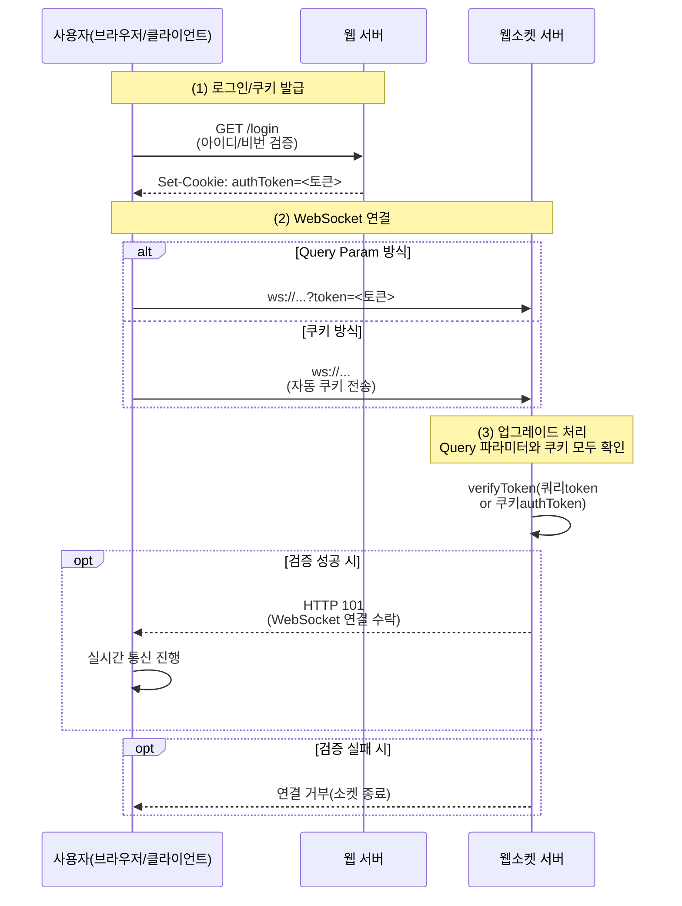

**웹 서버**(쿠키 발급)와 **웹소켓 서버**(Query Param / Cookie 동시 지원) 간의 **전체 흐름**

### 다이어그램 설명

1. **사용자**가 **웹 서버**에 로그인 요청을 보내면, **웹 서버**는 아이디/비밀번호 검증 후 `authToken` 쿠키를 설정(`Set-Cookie`).
2. **사용자**가 **웹소켓 서버**로 연결할 때,
    - **Query Param**(`ws://...?token=...`) **또는**
    - **쿠키**(`Cookie: authToken=...`)를 이용합니다.
3. **웹소켓 서버**는 `'upgrade'` 이벤트 시점에 **토큰**을 확인(쿼리/쿠키 모두 체크)하고,
    - 유효하면 **WebSocket 연결**을 수락
    - 실패하면 **연결**을 거부합니다.

이로써, **단일 소켓 서버**가 **Query Param**과 **Cookie** 방식을 **동시에** 지원할 수 있으며, 브라우저 환경에서는 쿠키 방식, 기타 클라이언트(C++/모바일 등)에서는 파라미터 방식을 사용할 수 있어 **확장성**을 높일 수 있습니다.
