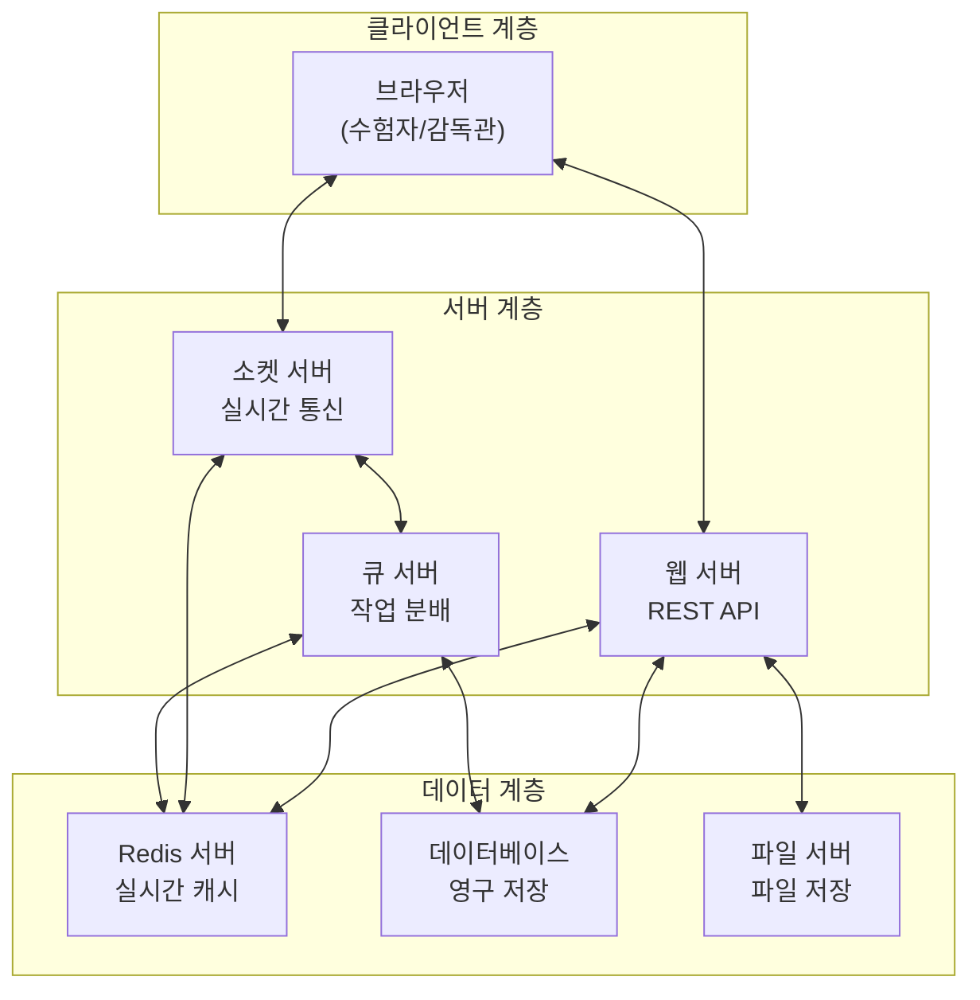

# 시험 시스템 아키텍처 명세서 (Exam System Architecture Specification)

## 1. 시스템 개요

본 시스템은 온라인 시험 진행을 위한 실시간 모니터링, 부정행위 감지, 답안 관리 등을 지원하는 분산 시스템입니다.

## 2. 시스템 구성 요소

### 2.1 클라이언트 계층 (Client Layer)

-   **브라우저 (Browser)**
    -   수험자/감독관 인터페이스 제공
    -   실시간 감시 기능 (카메라, 화면, 입력 등)
    -   WebSocket을 통한 실시간 통신
    -   부정행위 방지를 위한 브라우저 제어

### 2.2 서버 계층 (Server Layer)

#### 2.2.1 웹 서버 (Web Server)

-   **주요 기능**
    -   REST API 엔드포인트 제공
    -   인증/인가 처리
    -   시험 진행 상태 관리
    -   답안 제출/저장 처리

#### 2.2.2 소켓 서버 (Socket Server)

-   **주요 기능**
    -   WebSocket 연결 관리
    -   실시간 이벤트 처리
    -   부정행위 감지 데이터 수집
    -   실시간 모니터링 데이터 전송
    -   감독관-수험자 실시간 통신

#### 2.2.3 큐 서버 (Queue Server)

-   **주요 기능**
    -   이벤트 메시지 큐잉
    -   부정행위 감지 작업 분배
    -   비동기 작업 처리
    -   시스템 부하 분산

### 2.3 데이터 계층 (Data Layer)

#### 2.3.1 Redis 서버 (Redis Server)

-   **주요 기능**
    -   실시간 상태 정보 캐싱
    -   세션 관리
    -   수험자 답안 임시 저장
    -   실시간 이벤트 데이터 저장

#### 2.3.2 데이터베이스 서버 (Database Server)

-   **주요 기능**
    -   시험 계획/단계 정보 저장
    -   수험자/감독관 정보 관리
    -   답안 데이터 영구 저장
    -   이벤트/로그 데이터 저장
    -   부정행위 기록 관리

#### 2.3.3 파일 서버 (File Server)

-   **주요 기능**
    -   답안 첨부 파일 저장
    -   부정행위 증거 자료 저장
    -   캡처 이미지 저장
    -   임시 파일 관리

## 3. 데이터 흐름

### 3.1 실시간 모니터링 흐름

1. 브라우저 → 소켓 서버: 실시간 감시 데이터 전송
2. 소켓 서버 → 큐 서버: 부정행위 감지 분석 요청
3. 큐 서버 → Redis: 실시간 상태 업데이트
4. 소켓 서버 → 감독관 브라우저: 모니터링 데이터 전송

### 3.2 답안 제출 흐름

1. 브라우저 → 웹 서버: 답안 데이터 전송
2. 웹 서버 → Redis: 임시 저장
3. 웹 서버 → 파일 서버: 첨부 파일 저장
4. 웹 서버 → 데이터베이스: 답안 영구 저장

### 3.3 부정행위 감지 흐름

1. 브라우저 → 소켓 서버: 감시 데이터 전송
2. 소켓 서버 → 큐 서버: 분석 작업 등록
3. 큐 서버 → 웹 서버: 부정행위 판정
4. 웹 서버 → 데이터베이스: 부정행위 기록
5. 소켓 서버 → 감독관 브라우저: 경고 알림

## 4. 보안 고려사항

### 4.1 네트워크 보안

-   WebSocket 연결 SSL/TLS 암호화
-   API 엔드포인트 인증/인가
-   네트워크 트래픽 모니터링

### 4.2 데이터 보안

-   답안 데이터 암호화 저장
-   세션 데이터 보안
-   파일 접근 권한 관리

### 4.3 시스템 보안

-   서버 접근 제어
-   로그 모니터링
-   백업 및 복구 체계

## 5. 확장성 고려사항

-   서버 수평적 확장 가능 구조
-   마이크로서비스 아키텍처 고려
-   로드 밸런싱 지원
-   데이터 분산 저장 구조

