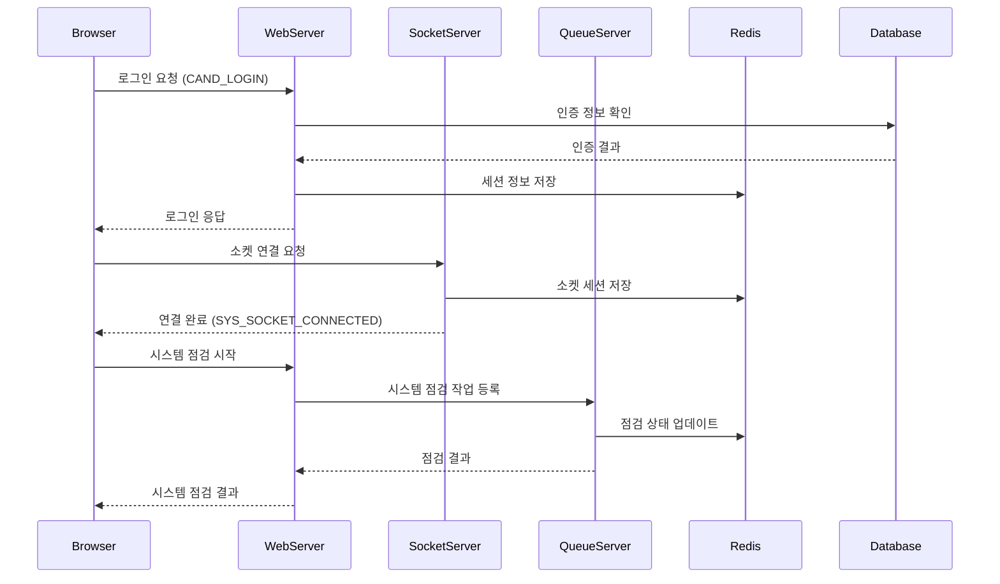
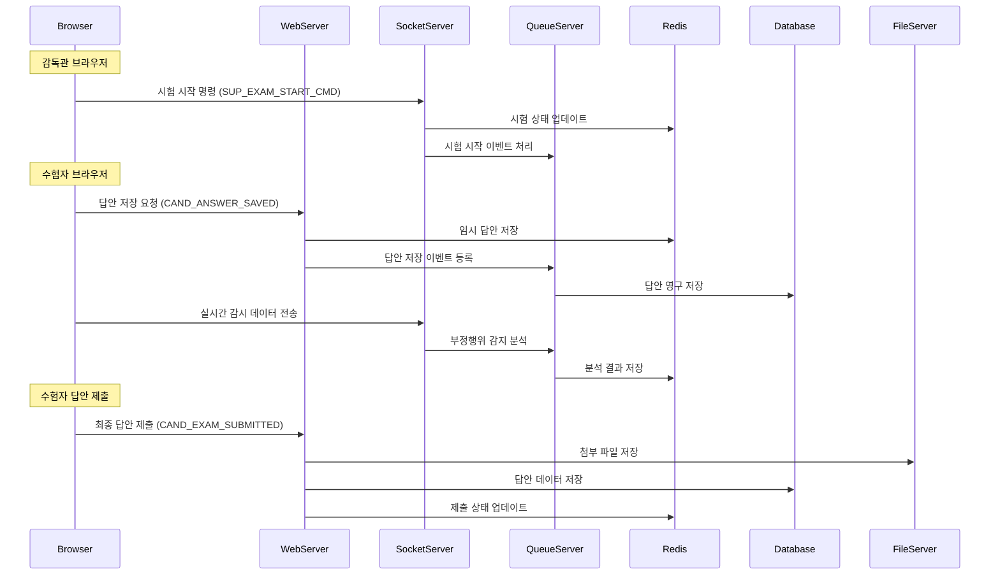
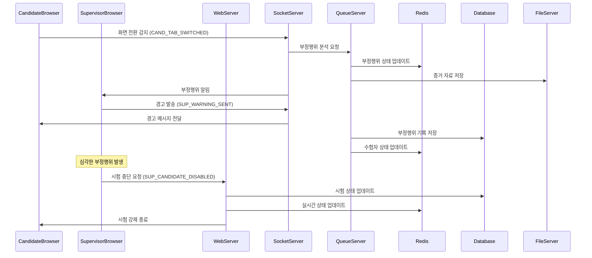

# 시험 시스템 주요 이벤트 시나리오

## 1. 주요 이벤트 목록

### 1.1 시험 시작 전 이벤트

-   CAND_LOGIN: 수험자 로그인
-   SYS_SOCKET_CONNECTED: 소켓 연결
-   CAND_BROWSER_OPENED: 브라우저 실행
-   SUP_LOGIN: 감독관 로그인

### 1.2 시험 진행 중 이벤트

-   SUP_EXAM_START_CMD: 시험 시작 명령
-   CAND_EXAM_STARTED: 시험 시작
-   CAND_ANSWER_SAVED: 답안 저장
-   CAND_ANSWER_MODIFIED: 답안 수정
-   SUP_WARNING_SENT: 경고 발송
-   CAND_EXAM_SUBMITTED: 답안 제출

### 1.3 부정행위 관련 이벤트

-   CAND_TAB_SWITCHED: 탭 전환
-   CAND_SCREEN_CAPTURED: 화면 캡처
-   SUP_CHEATING_DETECTED: 부정행위 감지
-   SUP_EVIDENCE_CAPTURED: 증거 확보

